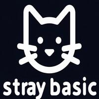

## A street Basic imaginary dialect

This interpreter simulates an old fashioned BASIC system, a "street Basic"
as Kemeny and Kurtz called them, which runs on top of a 16-bit computer.

The techniques used are primitive and imitate the ones employed by 70s
interpreters, obsessed with space saving at the expense of time and
maintainability. (It may well be that that some unconscious adolescent
reminiscence of my past with the ZX Spectrum influenced the development
of this code.)

The project was originally designed and implemented for a speech at the
Codemotion Milan conference in 2024, commemorating the 60 years of the Basic
programming language: I continued to work on the compiler also after the conference, fixing bugs and extending it up to a satisfying degree of completeness as far as the 80s standards are concerned.

A tutorial and reference for StrayBasic is here [doc/straybasic.md](straybasic.md), while some samples in the [samples](samples) folder.

Enjoy!

Paolo